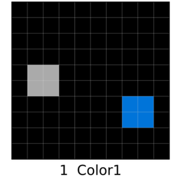
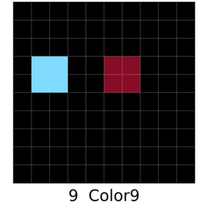
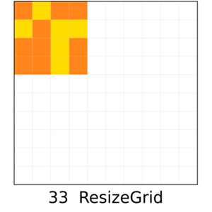
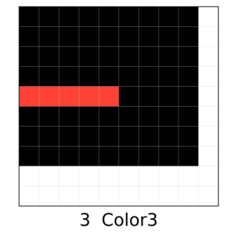
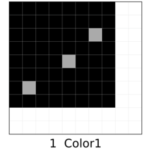
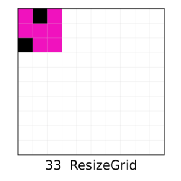
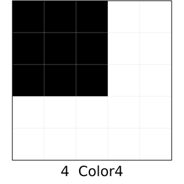
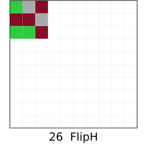
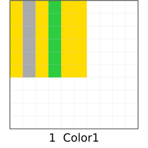
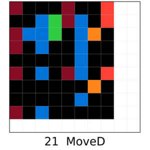

# SOLAR-LDCQ: Latent Diffusion Constrained Q-Learning for ARC-AGI

**SOLAR** (Synthesized Offline Learning data for Abstraction and Reasoning) is a trajectory-based dataset that converts ARC-AGI tasks into validated offline RL episodes. **LDCQ** (Latent Diffusion Constrained Q-learning) applies a proposal–selection framework on top of SOLAR to solve ARC-AGI tasks via offline RL.

---

## Task Gallery

Expert trajectories on representative tasks (each GIF shows step-by-step solving):

| `5c0a986e` | `5c0a986e` | `4c4377d9` | `a65b410d` | `4258a5f9` |
|:---:|:---:|:---:|:---:|:---:|
|  |  |  |  |  |

| `007bbfb7` | `6f8cd79b` | `74dd1130` | `0d3d703e` | `1e0a9b12` |
|:---:|:---:|:---:|:---:|:---:|
|  |  |  |  |  |

---

## Overview

### SOLAR Dataset

Standard ARC-AGI provides only input–output pairs without executable trajectories, which prevents analysis of intermediate decision errors. SOLAR addresses this by providing:

- **Ground-truth trajectories**: explicit state–action sequences validated in the [ARCLE](https://github.com/ConfeitoHS/arcle) environment
- **Controlled quality**: mix of expert and suboptimal trajectories for systematic distributional analysis
- **JSON episode format**: directly usable for offline RL training

Each episode: `τ = {(s_t, a_t, s_{t+1}, r_t)}` with sparse reward on correct `Submit`.

### LDCQ Architecture

```
Training Distribution D
    ↓
[Stage 1] β-VAE Skill Model        → encodes action segments into latent z
    ↓
[Stage 2] Collect Diffusion Data   → latent trajectories from β-VAE
    ↓
[Stage 3] Diffusion Prior          → learns p(z | state, task_context)
    ↓
[Stage 4] Collect Q-Learning Data  → rollouts with diffusion proposals
    ↓
[Stage 5] Q-Network                → Q(state, z) for selecting best proposal
```

At inference: sample K candidates `{z_k}` from diffusion prior, select `z* = argmax_k Q(s, z_k)`, execute.

---

## Repository Structure

```
.
├── LDCQ-ARC/               # LDCQ model and training pipeline
│   ├── models/             # β-VAE skill model, diffusion, Q-network, baselines
│   ├── training/           # 5-stage training scripts
│   ├── eval/               # Evaluation scripts
│   ├── utils/              # Shared utilities
│   └── README.md           # Detailed training guide
│
├── SOLAR-Generator/        # Trajectory data generation
│   ├── maker/              # Per-task grid makers
│   ├── generate_trajectory.py
│   ├── visualize_trajectory.py
│   └── README.md           # Generation guide
│
└── example_image/          # GIF and image assets for this README
```

---

## Installation

```bash
git clone https://github.com/QAZyunho/solar_ldcq.git
cd solar_ldcq

# Install LDCQ dependencies
pip install -r LDCQ-ARC/requirements.txt

# Install SOLAR-Generator dependencies
pip install -r SOLAR-Generator/requirements.txt

# For GIF visualization (Linux)
sudo apt install ffmpeg
```

**Key dependencies:**
- `arcle == 0.2.5`
- `torch >= 2.0`
- `gymnasium`
- `wandb` (optional, for logging)

---

## Quick Start

### Step 1: Generate SOLAR Dataset

```bash
cd SOLAR-Generator

# Generate expert trajectories for a task
python generate_trajectory.py \
    --tasks 46442a0e \
    --num_samples 5000 \
    --horizon 5 \
    --delete_existing_data True

# Visualize a trajectory
python visualize_trajectory.py \
    --mode gif \
    --file_path ARC_data/whole/46442a0e/46442a0e-expert_1.json \
    --save_folder_path figure/
```

### Step 2: Run Full LDCQ Training Pipeline

```bash
cd LDCQ-ARC/training/1_0

# Stage 1: Train β-VAE skill model
bash gpu0_train_1_skill_model.sh

# Stage 2: Collect diffusion training data
bash gpu0_train_2_collect_diffusion_data.sh

# Stage 3: Train diffusion prior
bash gpu0_train_3_diffusion.sh

# Stage 4: Collect Q-learning data
bash gpu0_train_4_collect_q_learning.sh

# Stage 5: Train Q-network
bash gpu0_train_5_q_learning.sh
```

### Step 3: Evaluate

```bash
cd LDCQ-ARC/eval
bash gpu0_test_ARCLE.sh
```

---

